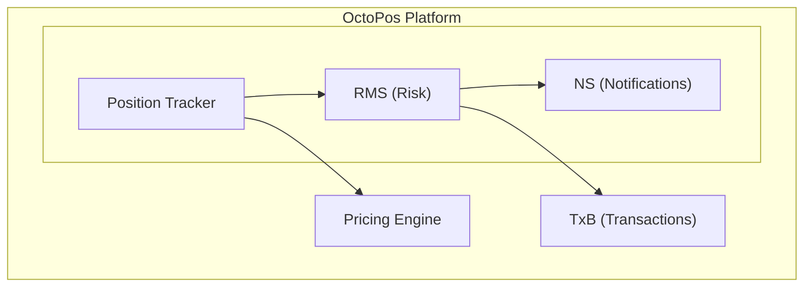
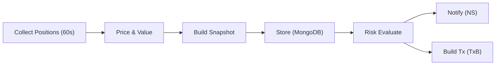

# Introduction to OctoPos

## What is OctoPos?

**OctoPos** is a comprehensive DeFi intelligence platform for the Stellar blockchain. It provides real-time position tracking, risk monitoring, and transaction execution services for users interacting with Stellar DeFi protocols.

OctoPos is part of the Untangled Finance ecosystem — the data backbone that powers OctoVault's real-time NAV calculations, portfolio analytics, and risk management.

## Core Services

### 1. Position Tracker
Tracks user positions across multiple Stellar DeFi protocols with real-time pricing.

### 2. Risk Monitoring Service (RMS)
Continuously monitors lending, AMM, and DeFi positions across Blend, Aquarius, SoroSwap, Phoenix, FxDAO, and other protocols for risk conditions and triggers alerts when thresholds are crossed.

### 3. Transaction Builder (TxB)
Builds optimized Stellar Soroban transactions for position exits (repay, liquidate, unwind).

### 4. Notification Service (NS)
Delivers risk alerts to users via Telegram, Discord, and Email.

## Core Capabilities

- **Multi-protocol aggregation** — Tracks positions across Blend, Aquarius, SoroSwap, Phoenix, FxDAO, and native Stellar wallets in a single query
- **6-feed price priority chain** — Aquarius AMM → Wrapped Assets → Blend Oracle → StellarExpert → DeFiLlama → Untangled Vault NAV, with automatic fallback and cross-validation
- **Real-time tracking** — 60-second position collection loop with raw snapshots, hourly OHLC, and daily OHLC rollups
- **Risk monitoring** — Continuous evaluation of positions across multiple protocols with configurable thresholds
- **Transaction building** — Build repay, liquidation, and unwind transactions with slippage control
- **Multi-channel alerts** — Telegram, Discord, and Email notifications for risk events

## Architecture Overview

OctoPos consists of four interconnected services:

## Data Flow

## API Subscriptions

Access OctoPos API via **X402 protocol** — pay with Stellar USDC for 30-day subscriptions.

| Tier | Rate Limit | Duration | Price |
|------|------------|----------|-------|
| Standard | 60 req/min | 30 days | $0.2026 |
| Partner | Custom | Custom | Negotiated |

Supported wallets: **Freighter**, Albedo. See [Subscriptions](./subscriptions) for details.

## REST API

OctoPos exposes a unified REST API with API key authentication and tiered rate limiting:

### Position Endpoints

| Endpoint | Method | Description |
|----------|--------|-------------|
| `/positions/:addr` | GET | All positions for a Stellar address |
| `/summary` | GET | Portfolio summary with total value |
| `/history` | GET | Historical portfolio snapshots |
| `/yield` | GET | Yield metrics per protocol |
| `/events` | GET | Position lifecycle events |

### Risk & Transaction Endpoints

| Endpoint | Method | Description |
|----------|--------|-------------|
| `/rms/risk/:addr` | GET | Risk evaluation for a wallet |
| `/rms/config/:addr` | GET/POST | Risk threshold configuration |
| `/txb/build` | POST | Build a repay/liquidate transaction |
| `/txb/proposals` | GET | Get transaction proposals |

### System Endpoints

| Endpoint | Method | Description |
|----------|--------|-------------|
| `/protocols` | GET | List supported protocols |
| `/protocols/:id/stats` | GET | Protocol-level statistics |
| `/health` | GET | System health + data freshness |
| `/rms/notifications/telegram` | GET/POST/DELETE | Telegram notification config |

API key tiers: **Free** (rate-limited) · **Standard** · **Partner** (custom limits).

See [Architecture](./architecture) for system design and [RMS](./rms) for risk monitoring details.

## Supported Protocols

| Protocol | Type | OctoPos Adapter |
|----------|------|---------------|
| Blend Capital | Lending | `blend` — supply (bTokens), borrow (dTokens) |
| Aquarius AMM | Liquidity Pool | `aquarius` — LP shares + claimable AQUA rewards |
| SoroSwap | Liquidity Pool | `soroswap` — LP token valuation |
| Phoenix DeFi Hub | Staking + LP | `phoenix` — LP + staking positions + pending rewards |
| FxDAO | CDP | `fxdao` — collateral deposited + debt minted |
| Native Stellar | Wallet | `stellar-wallet` — XLM balance + all trustlines |
| Untangled Vaults | ERC-4626 Vault | `untangled-vault` — vault share balances, NAV pricing |

## Supported Price Feeds

| Priority | Feed | Source | Best For |
|----------|------|--------|----------|
| 0 | Aquarius AMM | Aquarius AMM swap quotes | Stellar-native tokens with liquid pools |
| 1 | Wrapped Asset | Underlying price × rate | Wrapped/yield-bearing tokens (e.g., yXLM) |
| 2 | Blend Oracle | Blend on-chain oracle | Assets in Blend pools |
| 3 | StellarExpert | StellarExpert API | Stellar Classic assets, known Soroban tokens |
| 4 | DeFiLlama | DeFiLlama aggregator | Broad coverage, last resort |

See [Architecture](./architecture) and [Adapters & Price Feeds](./adapters) for deeper documentation.
