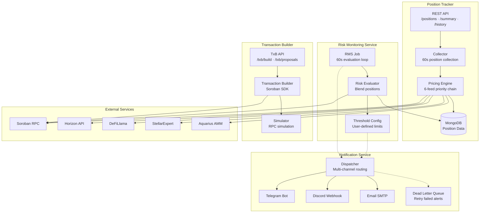
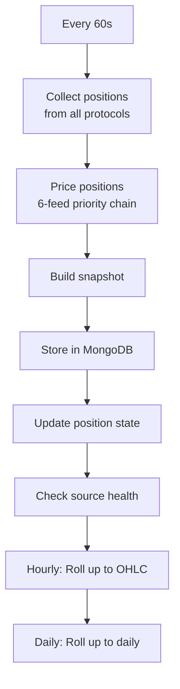
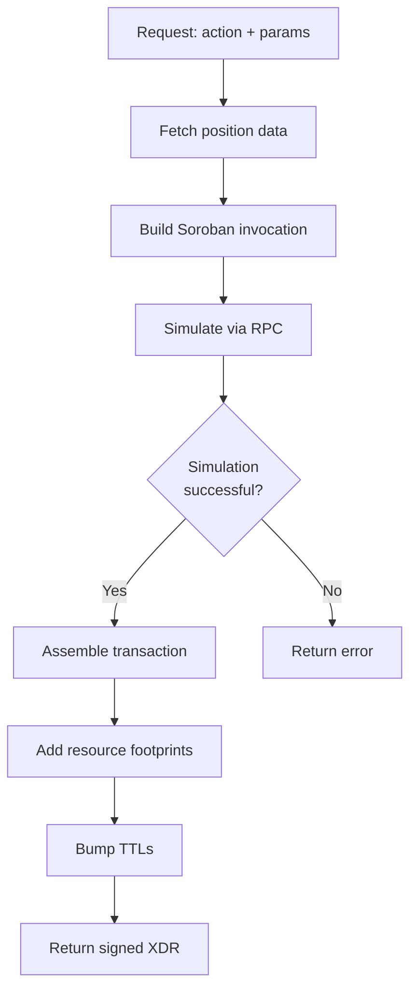

# OctoPos Architecture

## System Overview

OctoPos is a modular platform with four interconnected services that work together to provide comprehensive DeFi intelligence on Stellar.



## Core Services

### Position Tracker

The Position Tracker continuously monitors user positions across Stellar DeFi protocols.

**Responsibilities:**
- Collect positions every 60 seconds from all supported protocols
- Price positions using a 6-feed priority chain
- Store snapshots and maintain historical data
- Monitor data source health

**Data Collections:**
| Collection | Purpose |
|-----------|---------|
| `position_snapshots` | Full portfolio snapshots (90-day TTL) |
| `position_states` | Current position state |
| `event_logs` | Lifecycle events (1-year TTL) |
| `price_cache` | Cached token prices (5-min TTL) |
| `source_health` | Data source health metrics |

### Risk Monitoring Service (RMS)

RMS continuously evaluates positions across Blend, Aquarius, SoroSwap, Phoenix, FxDAO, and other protocols for risk conditions and triggers notifications.

**Risk Levels:**
| Level | Health Factor | Description |
|-------|---------------|-------------|
| `healthy` | ≥ 1.50 | Position is healthy |
| `warn` | 1.25 – 1.50 | Attention recommended |
| `alert` | 1.10 – 1.25 | Action recommended |
| `emergency` | < 1.10 | Immediate action required |

**Risk Triggers:**
| Trigger | Description |
|---------|-------------|
| `low_health_factor` | Health factor below threshold |
| `oracle_stale` | Price oracle data is outdated |
| `oracle_price_manipulation` | Potential price manipulation detected |
| `pool_utilization_high` | Pool utilization exceeds safe limits |
| `pool_freeze` | Pool operations have been paused |
| `borrow_apr_spike` | Borrow rate increased significantly |
| `collateral_depeg` | Collateral asset losing peg stability |
| `collateral_liquidity_low` | Insufficient liquidity for liquidation |

### Transaction Builder (TxB)

TxB builds optimized Soroban transactions for position management.

**Supported Operations:**
| Operation | Description |
|-----------|-------------|
| `REPAY` | Repay borrowed assets to improve health factor |
| `LIQUIDATE` | Liquidate undercollateralized position |
| `UNWIND` | Close entire position (withdraw + repay) |

**Features:**
- Real Soroban SDK integration
- Transaction simulation before submission
- Slippage protection (configurable BPS)
- TTL bumping for safety margin
- Resource footprint optimization

### Notification Service (NS)

NS delivers risk alerts through multiple channels with retry logic.

**Supported Channels:**
| Channel | Setup |
|---------|-------|
| Telegram | Bot token + chat ID |
| Discord | Webhook URL |
| Email | SMTP configuration |

**Features:**
- Alert cooldowns to prevent spam
- Dead letter queue for failed deliveries
- Priority routing (normal/urgent)
- Per-user notification preferences

## Design Principles

1. **Mainnet-only** — All operations target Stellar mainnet
2. **Resilient** — Services are independent; failures are isolated
3. **Configurable** — Thresholds and settings are user-defined
4. **Extensible** — New protocols and feeds can be added
5. **Observable** — Health monitoring and logging throughout

## Data Flow

### Position Collection Loop



### Risk Evaluation Loop

```mermaid
flowchart TD
    R1[Every 60s] --> R2[Fetch positions<br/>(all protocols)]
    R2 --> R3[Evaluate each position]
    R3 --> R4{Risk level<br/>changed?}
    R4 -->|Yes| R5[Trigger notification]
    R4 -->|No| R6[Log evaluation]
    R5 --> R7[Route to NS]
    R7 --> R8[Dispatch via<br/>Telegram/Discord/Email]
    R6 --> R9[End]
```

### Transaction Building Flow


