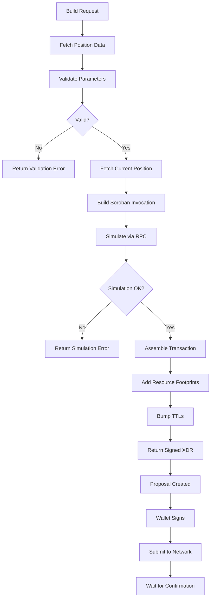

# Transaction Builder (TxB)

## Overview

The Transaction Builder creates optimized Stellar Soroban transactions for Blend lending operations. It integrates with the real Stellar SDK to build, simulate, and prepare transactions for signing.

TxB receives risk signals from RMS and builds appropriate transactions to help users manage their lending positions.

## Supported Operations

| Operation | Description | Use Case |
|-----------|-------------|----------|
| `REPAY` | Repay borrowed assets | Improve health factor |
| `LIQUIDATE` | Liquidate collateral | Earn liquidation bonus |
| `UNWIND` | Close entire position | Full exit from pool |

---

## Building Transactions

### POST /api/v1/txb/build

Build a repay or liquidate transaction.

**Request:**
```json
{
  "action": "REPAY",
  "walletAddress": "GABC...XYZ",
  "poolAddress": "CAWKIJ6FVZUS7LVOHNTO2FBPTLOQKXWFWYZPOGCCCWVRJN7ARGOMABWV",
  "tokenId": "CCW67TSZV3SSS2HXMBQ5JFGCKJNXKZM7UQUWUZPUTHXSTZLEO7SJMI75",
  "amount": "1000000",
  "slippageBps": 50
}
```

| Field | Type | Required | Description |
|-------|------|----------|-------------|
| `action` | string | Yes | `REPAY` or `LIQUIDATE` |
| `walletAddress` | string | Yes | Stellar G-address |
| `poolAddress` | string | Yes | Blend pool contract address |
| `tokenId` | string | Yes | Token contract address |
| `amount` | string | No | Amount in stroops (omit for max) |
| `slippageBps` | number | No | Slippage tolerance (default: 50 = 0.5%) |

**Response:**
```json
{
  "success": true,
  "transaction": {
    "transactionXdr": "AAAA...",
    "sourceAddress": "GABC...XYZ",
    "operations": 1,
    "createdAt": "2026-04-13T12:00:00.000Z"
  },
  "proposal": {
    "id": "txp-1713004800000-abc123",
    "status": "pending",
    "expiresAt": "2026-04-13T12:05:00.000Z",
    "metadata": {
      "poolAddress": "CAWKIJ6FVZUS7LVOHNTO2FBPTLOQKXWFWYZPOGCCCWVRJN7ARGOMABWV",
      "tokenId": "CCW67TSZV3SSS2HXMBQ5JFGCKJNXKZM7UQUWUZPUTHXSTZLEO7SJMI75",
      "amount": "1000000",
      "action": "REPAY"
    }
  },
  "warnings": []
}
```

---

## Getting Proposals

### GET /api/v1/txb/proposals

Retrieve transaction proposals for a wallet.

**Query Parameters:**
- `wallet` — Wallet address (required)

**Response:**
```json
{
  "success": true,
  "proposals": [
    {
      "id": "txp-1713004800000-abc123",
      "status": "pending",
      "expiresAt": "2026-04-13T12:05:00.000Z",
      "transaction": {
        "transactionXdr": "AAAA...",
        "sourceAddress": "GABC...XYZ",
        "operations": 1,
        "createdAt": "2026-04-13T12:00:00.000Z"
      },
      "metadata": {
        "poolAddress": "CAWKIJ6FVZUS7LVOHNTO2FBPTLOQKXWFWYZPOGCCCWVRJN7ARGOMABWV",
        "tokenId": "CCW67TSZV3SSS2HXMBQ5JFGCKJNXKZM7UQUWUZPUTHXSTZLEO7SJMI75",
        "action": "REPAY"
      }
    }
  ],
  "total": 1,
  "timestamp": "2026-04-13T12:01:00.000Z"
}
```

### Proposal Statuses

| Status | Description |
|--------|-------------|
| `pending` | Awaiting signature |
| `signed` | Transaction signed, ready for submission |
| `submitted` | Transaction submitted to network |
| `confirmed` | Transaction confirmed on-chain |
| `failed` | Transaction failed or expired |

---

## Slippage Protection

Slippage tolerance protects against price movement during transaction execution.

| BPS | Percentage | Use Case |
|-----|------------|----------|
| 10 | 0.1% | Stable pairs (USDC/USDC) |
| 50 | 0.5% | Default for most operations |
| 100 | 1.0% | Volatile pairs |
| 500 | 5.0% | High volatility assets |

**Example:**
- Slippage: 50 BPS (0.5%)
- Repay amount: 1,000 USDC
- Maximum cost: 1,005 USDC

---

## Transaction Lifecycle



---

## Validation Rules

| Field | Validation |
|-------|-----------|
| `walletAddress` | Must be valid Stellar G-address (G...) |
| `poolAddress` | Must be valid Stellar C-address (C...) |
| `tokenId` | Must be valid Stellar C-address |
| `amount` | Must be non-negative integer string |
| `slippageBps` | Must be 0-10000 (0%-100%) |

---

## Submitting Transactions

After building a transaction, sign it with your wallet and submit:

### POST /api/v1/txb/submit

Submit a signed transaction.

**Request:**
```json
{
  "transactionXdr": "AAAA...",
  "rpcUrl": "https://mainnet.sorobpc.com"
}
```

**Response:**
```json
{
  "success": true,
  "txHash": "abc123...def456"
}
```

---

## Batch Operations

For positions with multiple debt tokens, you can build multiple transactions or use the **Unwind** operation to close the entire position in one transaction.

### Unwind Transaction

An unwind transaction:
1. Withdraws all collateral
2. Repays all debt via flash loan
3. Returns remaining funds to wallet

**Note:** Unwind transactions may require multiple operations. The maximum Soroban operations per transaction is **10**.

---

## Error Handling

| Error Code | Description |
|------------|-------------|
| `VALIDATION_FAILED` | Invalid request parameters |
| `NO_POSITION_FOUND` | No position exists for the given token |
| `NO_DEBT_TO_REPAY` | No debt to repay |
| `NO_COLLATERAL_TO_LIQUIDATE` | No collateral available |
| `SIMULATION_FAILED` | RPC simulation failed |
| `TOO_MANY_OPERATIONS` | Exceeds Soroban operation limit |

---

## Status Endpoint

### GET /api/v1/txb/status

Check TxB service health.

**Response:**
```json
{
  "success": true,
  "service": "txb",
  "status": "running",
  "proposalsInMemory": 15,
  "timestamp": "2026-04-13T12:00:00.000Z"
}
```
