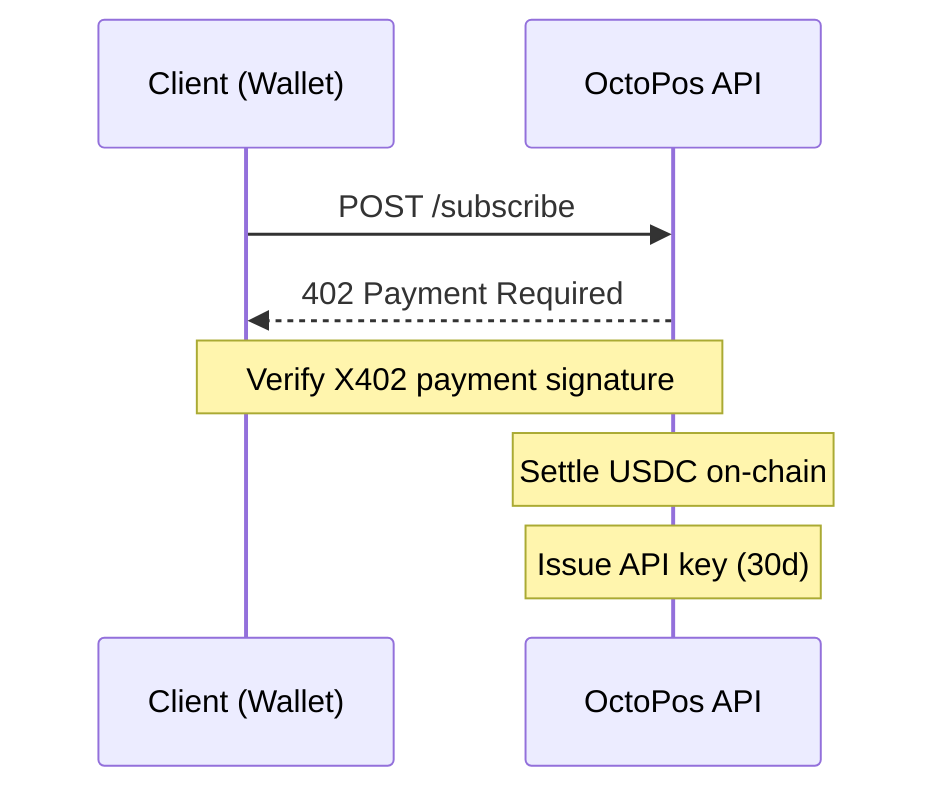

# API Subscriptions

OctoPos uses the **X402 protocol** to enable programmable HTTP payments for API access. Subscribe to unlock standard-tier API access using **Stellar USDC**.

## Overview

X402 is an open payment protocol that allows servers to charge for API access by requiring a cryptographic payment signature in the request headers. OctoPos implements the **Exact Stellar Scheme** — users pay with USDC on Stellar, and transaction fees are sponsored by the server.

### Key Features

| Feature | Description |
|---------|-------------|
| **Payment Method** | Stellar USDC (SOROBAN transfer) |
| **Price** | Configurable (default: $0.2026/month) |
| **Duration** | 30 days per subscription |
| **Fee Sponsorship** | Server sponsors Soroban fees |
| **Wallet Support** | Freighter, Albedo, and other Stellar wallets |
| **Network** | Stellar Pubnet (mainnet) |

## How It Works



## Subscription Tiers

| Tier | Rate Limit | Duration | Price |
|------|------------|----------|-------|
| **Standard** | 60 req/min | 30 days | $0.2026 |
| **Partner** | Custom | Custom | Negotiated |

## API Endpoints

### Subscribe (Direct Flow)

**POST** `/api/v1/keys/subscribe`

Protected endpoint requiring X402 payment. Client must include a valid `X-PAYMENT-SIGNATURE` header.

**Headers:**
```
X-PAYMENT-SIGNATURE: <base64-encoded payment signature>
```

**Request Body:**
```json
{
  "email": "user@example.com",
  "projectName": "My DeFi Dashboard"
}
```

**Response (Success):**
```json
{
  "apiKey": "op_live_xxxxxxxxxxxxxxxxxxxx",
  "tier": "standard",
  "rateLimit": 60,
  "expiresAt": "2026-05-13T00:00:00.000Z",
  "durationDays": 30,
  "network": "stellar:pubnet",
  "message": "Subscription active for 30 days. Store your API key — it will not be shown again."
}
```

**Response (Payment Required):**
```json
{
  "error": "Payment required",
  "status": 402,
  "paymentRequirements": {
    "scheme": "exact",
    "network": "stellar:pubnet",
    "payTo": "GXXXXXXXX...",
    "asset": "CDLZFC3SYJYDZT7K67VZ75HPJVIEUVNIXF47ZG2FB2RYAQB2K6LSLJD",
    "amount": "202600",
    "maxTimeoutSeconds": 600
  }
}
```

---

### Subscribe (Server-Assisted Flow)

For wallets that don't support raw X402 signing (like Freighter), use the two-step flow:

#### Step 1: Prepare

**POST** `/api/v1/keys/subscribe/prepare`

Builds the USDC transfer transaction server-side.

**Request Body:**
```json
{
  "walletAddress": "GXXXXXXXXXXXXXXXXXXXXXXXXXXXXXXXXXXXXXXXXXXXXXXXXXXXX"
}
```

**Response:**
```json
{
  "txJson": "{...}",
  "preimageXdrs": ["AAAA...", "AAAA..."],
  "maxLedger": 123456789,
  "networkPassphrase": "Public Global Stellar Network ; September 2015",
  "x402Version": 2
}
```

#### Step 2: Complete

**POST** `/api/v1/keys/subscribe/complete`

Submits signed transaction, settles payment, and issues API key.

**Request Body:**
```json
{
  "walletAddress": "GXXXXXXXXXXXXXXXXXXXXXXXXXXXXXXXXXXXXXXXXXXXXXXXXXXXX",
  "txJson": "{...}",
  "preimageXdrs": ["AAAA...", "AAAA..."],
  "signedAuthEntries": ["AAAA...", "AAAA..."],
  "maxLedger": 123456789,
  "email": "user@example.com",
  "projectName": "My DeFi Dashboard"
}
```

**Response:**
```json
{
  "apiKey": "op_live_xxxxxxxxxxxxxxxxxxxx",
  "tier": "standard",
  "rateLimit": 60,
  "expiresAt": "2026-05-13T00:00:00.000Z",
  "durationDays": 30,
  "network": "stellar:pubnet",
  "payTo": "GXXXXXXXX..."
}
```

---

### Check Subscription Status

**GET** `/api/v1/keys/subscribe/status?email=<email>`

Check if an email has an active subscription.

**Response:**
```json
{
  "active": true,
  "tier": "standard",
  "rateLimit": 60,
  "expiresAt": "2026-05-13T00:00:00.000Z",
  "lastPayment": {
    "network": "stellar:pubnet",
    "amountUsd": "0.20",
    "txHash": "abc123...",
    "paidAt": "2026-04-13T00:00:00.000Z"
  }
}
```

## Payment Flow

### Direct X402 (Advanced)

1. Client fetches payment requirements from 402 response header
2. Client builds USDC transfer transaction locally
3. Client signs transaction with wallet
4. Client sends request with `X-PAYMENT-SIGNATURE` header
5. Server verifies signature and settles payment on-chain

### Server-Assisted Flow (Recommended)

1. Client sends wallet address to `/subscribe/prepare`
2. Server builds transaction and returns auth entry preimages
3. Client wallet signs the preimages (via `signAuthEntry`)
4. Client sends signed preimages to `/subscribe/complete`
5. Server assembles, simulates, and settles transaction
6. Server issues API key

## Rate Limits

| Tier | Requests/Minute | Burst |
|------|-----------------|-------|
| Standard | 60 | 120 |
| Partner | 120+ | Custom |

## Environment Variables

Servers can configure subscription via environment variables:

| Variable | Default | Description |
|----------|---------|-------------|
| `X402_PAYMENT_ADDRESS_STELLAR` | — | Stellar address to receive payments |
| `X402_SUBSCRIPTION_PRICE` | `$0.2026` | Monthly price (USD) |
| `X402_SUBSCRIPTION_DAYS` | `30` | Subscription duration |
| `X402_STELLAR_NETWORK` | `stellar:pubnet` | Network (pubnet/testnet) |
| `X402_FACILITATOR_STELLAR_SECRET_KEY` | — | Server's secret key for fee sponsorship |
| `SOROBAN_RPC_URL` | — | Soroban RPC endpoint |
| `SUBSCRIPTION_SOROBAN_RPC_URL` | — | Dedicated RPC for subscriptions |

## Error Handling

| Status | Error | Cause |
|--------|-------|-------|
| 402 | Payment Required | No valid X402 signature |
| 400 | Bad Request | Invalid parameters |
| 503 | Service Unavailable | Payment not configured |

## Wallet Requirements

- Must support Soroban smart contract calls
- Must support auth entry signing (`signAuthEntry`)
- **Supported**: Freighter, Albedo
- **Testnet**: Test wallets supported with `stellar:testnet` network
