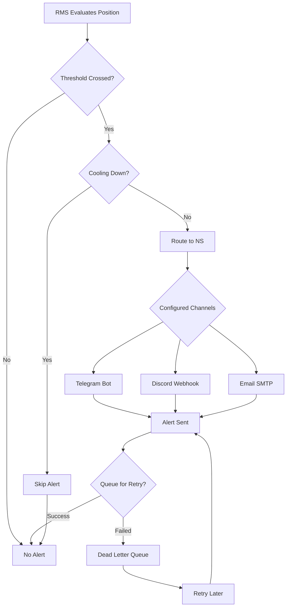

# Notifications

OctoPos delivers risk alerts to users through multiple channels. Configure your preferred notification method to stay informed about position risk changes.

## Overview

The Notification Service (NS) integrates with RMS to deliver alerts when lending, AMM, and DeFi positions cross risk thresholds across all supported protocols.

**Supported Channels:**
- **Telegram** — Direct messages to users or groups
- **Discord** — Webhook notifications to channels
- **Email** — SMTP-based email alerts

**Base path:** `https://octopos.untangled.finance/api/v1/rms/notifications/`

---

## Notification Flow



---

## Telegram Setup

### Finding Your Telegram chat_id

1. Open Telegram and message `@userinfobot`
2. It replies with your **user ID** (e.g., `123456789`)
3. For group alerts, add the bot to the group and get the group ID (a negative number)

### Register Notification Config

```
POST /api/v1/rms/notifications/telegram
Content-Type: application/json
```

**Request Body:**

```json
{
  "walletAddress": "GABC...XYZ",
  "telegramChatId": "123456789",
  "telegramBotToken": "123456:ABC-DEF...",
  "minRiskLevel": "high",
  "enabledChannels": ["telegram"]
}
```

| Field | Required | Default | Description |
|-------|----------|---------|-------------|
| `walletAddress` | Yes | — | Stellar wallet address |
| `telegramChatId` | Yes | — | Telegram user/group ID |
| `telegramBotToken` | No | server default | Custom bot token |
| `minRiskLevel` | No | `high` | Minimum alert level |
| `enabledChannels` | No | `["telegram"]` | Channels to use |

### Alert Cooldowns

| Risk Level | Cooldown |
|------------|----------|
| `healthy` | 1 hour |
| `warn` | 30 minutes |
| `alert` | 10 minutes |
| `emergency` | 2 minutes |

Cooldowns reset when a position's risk level **escalates** (not when it improves).

---

## Discord Setup

### Create a Webhook

1. Open Discord server settings → Integrations → Webhooks
2. Create a new webhook or copy an existing one
3. Note the webhook URL: `https://discord.com/api/webhooks/...`

### Register Discord Config

```
POST /api/v1/rms/notifications/discord
Content-Type: application/json
```

**Request Body:**

```json
{
  "walletAddress": "GABC...XYZ",
  "discordWebhook": "https://discord.com/api/webhooks/123456/abcdef",
  "minRiskLevel": "high"
}
```

---

## Email Setup

```
POST /api/v1/rms/notifications/email
Content-Type: application/json
```

**Request Body:**

```json
{
  "walletAddress": "GABC...XYZ",
  "email": "user@example.com",
  "minRiskLevel": "high"
}
```

**Email Server Configuration** (server-side):
| Variable | Description |
|----------|-------------|
| `SMTP_HOST` | SMTP server hostname |
| `SMTP_PORT` | SMTP server port |
| `SMTP_USER` | SMTP authentication username |
| `SMTP_PASSWORD` | SMTP authentication password |
| `EMAIL_FROM` | Sender email address |

---

## Alert Severity Levels

| Level | Health Factor | Severity | Recommended Action |
|-------|---------------|----------|-------------------|
| `low` | ≥ 1.50 | LOW | HOLD |
| `medium` | 1.25 – 1.50 | MEDIUM | WATCH |
| `high` | 1.10 – 1.25 | HIGH | REPAY |
| `critical` | < 1.10 | CRITICAL | LIQUIDATE |

---

## Alert Cooldowns

To prevent notification spam, alerts follow a cooldown schedule:

| Risk Level | Cooldown Period |
|------------|-----------------|
| `low` | 1 hour |
| `medium` | 30 minutes |
| `high` | 10 minutes |
| `critical` | 2 minutes |

**Escalation Bypass:** If a position's risk level worsens (e.g., from `warn` to `alert`), the cooldown is bypassed and an immediate alert is sent.

---

## Managing Notification Configs

### Get Configuration

```
GET /api/v1/rms/notifications?walletAddress=GABC...XYZ
```

### Delete Configuration

```
DELETE /api/v1/rms/notifications?walletAddress=GABC...XYZ&channel=telegram
```

---

## Manual Alert Trigger (Admin)

Force-send notifications for evaluation:

```
POST /api/v1/rms/notifications/trigger
x-admin-key: <RMS_ADMIN_API_KEY>
```

**Request Body:**

```json
{
  "walletAddress": "GABC...XYZ",
  "minRiskLevel": "alert"
}
```

Omit `walletAddress` to trigger for all registered wallets.

---

## Webhook Integration (External)

External systems can integrate via webhooks:

```
POST /api/v1/rms/notifications/webhook
Content-Type: application/json
X-Webhook-Secret: <SECRET>
```

**Webhook Payload:**

```json
{
  "source": "rms",
  "alert": {
    "alertId": "alert_001",
    "address": "GABC...XYZ",
    "poolAddress": "CAWKIJ6...",
    "riskLevel": "alert",
    "healthFactor": 1.15,
    "triggers": ["low_health_factor"],
    "collateralValueUsd": 10000,
    "liabilityValueUsd": 8695,
    "recommendedAction": "REPAY",
    "evaluatedAt": "2026-04-13T12:00:00.000Z"
  },
  "routing": {
    "channels": ["telegram", "discord"],
    "priority": "normal"
  },
  "timestamp": "2026-04-13T12:00:01.000Z"
}
```

---

## Dead Letter Queue

Failed notifications are queued for retry:

| Property | Value |
|----------|-------|
| Max Retries | 5 |
| Retry Interval | Exponential backoff |
| Final Expiry | After 24 hours |

Check DLQ status:

```
GET /api/v1/rms/notifications/dlq
```

---

## Environment Variables

| Variable | Description |
|----------|-------------|
| `TELEGRAM_BOT_TOKEN` | Default Telegram bot token |
| `RMS_ADMIN_API_KEY` | Admin API key for manual triggers |
| `SMTP_HOST` | Email SMTP server |
| `SMTP_PORT` | SMTP port (default: 587) |
| `SMTP_USER` | SMTP username |
| `SMTP_PASSWORD` | SMTP password |
| `EMAIL_FROM` | Sender email address |
