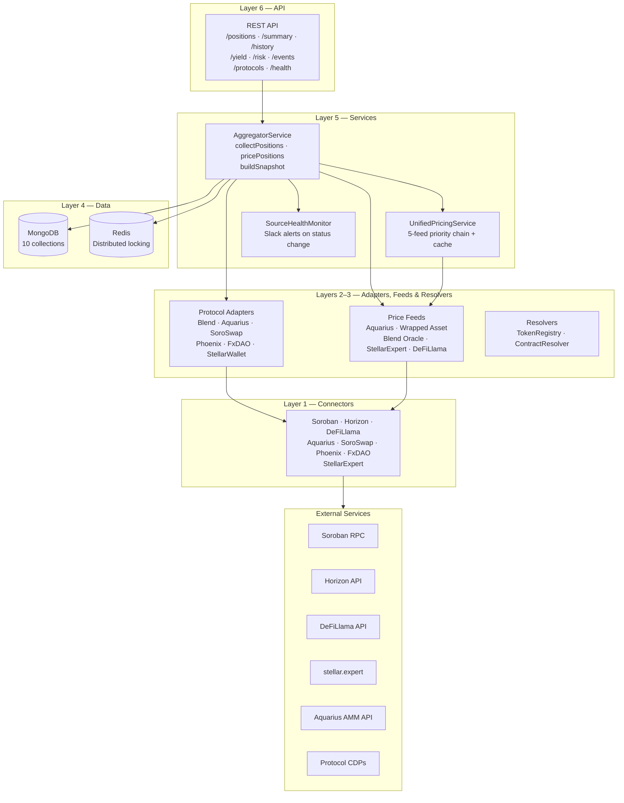
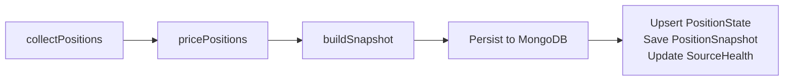
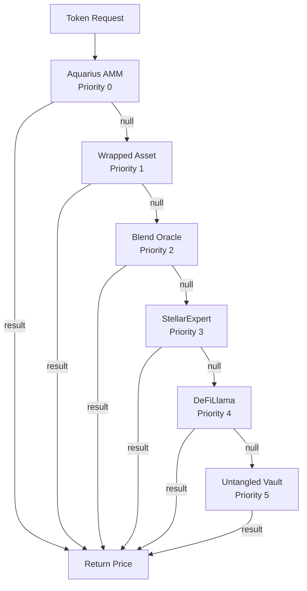
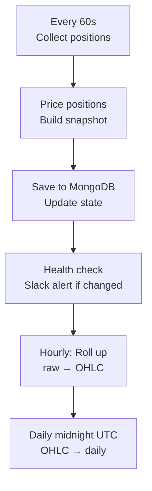

# OctoPos Architecture

## System Overview

## Layers

| Layer | Name | Responsibility |
|-------|------|---------------|
| 1 | Connectors | SDK wrappers for Soroban RPC, Horizon, DeFiLlama, protocol APIs |
| 2 | Adapters | Protocol-specific position extraction (Blend, Aquarius, SoroSwap, Phoenix, FxDAO, StellarWallet, UntangledVaults) |
| 3 | Feeds | Price data from 6-source priority chain (Aquarius → Wrapped Asset → Blend Oracle → StellarExpert → DeFiLlama → Untangled Vault) |
| 3b | Resolvers | Token symbol & contract type resolution |
| 3c | Introspection | On-chain contract state reading (reserves, TVL) |
| 4 | Data | MongoDB models, OHLC aggregation, health monitoring |
| 5 | Services | Orchestration (AggregatorService), pricing (UnifiedPricingService), health alerts |
| 6 | API | REST endpoints, API key auth, rate limiting, Gzip compression |

## Design Principles

1. **Mainnet-only** — No testnet support. Stellar mainnet prices and contracts only.
2. **YAML-driven config** — Token addresses, pool configs, and thresholds live in `tokens.yaml`, not in code.
3. **Priority feed chain** — 6 price feeds tried in order; first non-null result wins with cross-validation.
4. **Plugin-first extensibility** — New protocols added via drop-in TypeScript plugins; no core changes.
5. **Lazy registration** — Built-in adapters/feeds registered on first use to keep startup fast.
6. **Tiered aggregation** — Raw snapshots (60s) → hourly OHLC → daily OHLC for space-efficient history.
7. **Resilient** — Each adapter/feed is independent; failures are isolated and health-monitored with Slack alerts.
8. **G-address resolution** — C-addresses (Soroban contracts) are probed to detect type and resolve underlying G-addresses.

## Data Flow

## Price Feed Chain

## Tracker Loop

## MongoDB Collections

| Collection | Purpose | TTL |
|-----------|---------|-----|
| `octopos_position_snapshots` | Full portfolio snapshots (historical) | 90 days |
| `octopos_position_states` | Current position state | None |
| `octopos_event_logs` | Lifecycle events (deposit, liquidation, etc.) | 1 year |
| `octopos_price_cache` | Cached token prices | 5 minutes |
| `octopos_source_health` | Per-adapter health metrics | 30 days |
| `octopos_hourly_aggregates` | Hourly OHLC rollups | 90 days |
| `octopos_daily_aggregates` | Daily OHLC rollups | Permanent |
| `octopos_contract_types` | Resolved Soroban contract types | None |
| `octopos_tracked_addresses` | Addresses configured for tracking | None |
| `octopos_api_keys` | API key authentication records | None |
